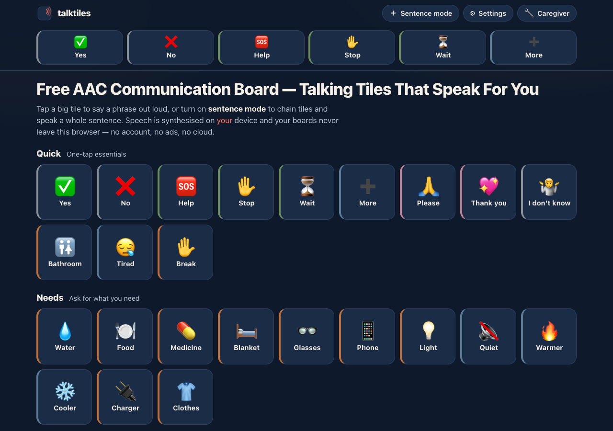

# talktiles

**Talking tiles that speak for you.** A free, private AAC (Augmentative and
Alternative Communication) board: tap a big emoji tile to say a phrase out loud, or
chain tiles on a sentence strip and speak the whole sentence. Speech is synthesised
on *your* device and your boards never leave your browser — no account, no ads, no
cloud. 100% client-side, zero dependencies, works fully offline.



## Who it's for

Non-speaking and low-literacy users — people with aphasia or in stroke recovery,
autistic children, elders, laryngectomy patients — and the caregivers, family
members and speech-language professionals who set up and customise boards for them.

## Why

Most communication boards you find online want an account, run in the cloud, or bury
a simple "tap to speak" tool under sign-ups and ads. talktiles is different: it does
**one job well** — let someone communicate by tapping tiles — and it is *private by
construction*. A strict Content-Security-Policy sets `connect-src 'none'`, so the
page **cannot** make a network request even if it tried. Nothing you type, edit or
say ever leaves the device.

## Features

- **Tap-to-speak tiles** — large, high-contrast emoji tiles that immediately speak
  their phrase via on-device `speechSynthesis`, with a coral sound-arc animation as
  non-audio feedback when a tile speaks.
- **120-phrase starter board** — 10 categories × 12 tiles (Quick, Needs, Pain & Body,
  Feelings, Food & Drink, People, Actions, Places, Questions, Social), each colour-tagged
  per the modified Fitzgerald Key convention as a muted tile edge-stripe.
- **Always-visible Quick bar** — Yes / No / Help / Stop / Wait / More, one tap, pinned
  at the top, positions never change.
- **Sentence strip** — turn on sentence mode, tap tiles to append short words to a
  strip, then Speak the composed sentence. Backspace, clear, and it persists across reloads.
- **Caregiver mode** — long-press the wrench and confirm (so users can't wander in) to
  add, edit, delete and reorder tiles with an emoji picker, label, spoken phrase and
  colour tag. Edits are append-only so existing tile positions stay motor-planning stable.
- **Honest voice picker** — defaults to voices that run **entirely on your device**;
  network-backed voices (e.g. Chrome's "Google …" voices) are hidden behind a toggle
  labelled *"remote — synthesised by your browser vendor's servers"*. Speed and pitch
  sliders, a test-speak button.
- **Export / import** — the whole board is a schema-stamped JSON file, the caregiver
  handoff between devices. Plus a **print-friendly paper backup** of every board.
- **Accessibility floor** — full keyboard operation (arrow-key grid navigation + Enter
  to speak), visible focus rings, a 3-step tile-size control, `prefers-reduced-motion`
  respected, and `touch-action: manipulation` to kill the double-tap zoom delay.

## Quickstart

Just open `index.html` in any modern browser — no build step, no server, no install.

- **Local:** double-click `index.html`, or run a static server in the folder.
- **Hosted:** **[Open talktiles live](https://sreenivas-sadhu-prabhakara.github.io/talktiles/)**

Your board, custom tiles, sentence strip and voice settings are saved in this
browser's local storage, so they persist between visits. The starter board works
instantly with zero setup.

> On iOS, audio needs one initial tap on the page before speech will play — that's a
> browser rule, not a talktiles limitation.

## Privacy

- A strict Content-Security-Policy sets `connect-src 'none'`: the app **cannot** make
  any network request. No fonts, scripts, images or analytics are loaded from anywhere.
- All logic runs in your browser; speech is synthesised on your own device.
- Because there are no network dependencies, it works with **no signal at all** —
  load it once and it keeps working offline.

## Colour convention

Tile edge-stripes follow the **Modified Fitzgerald Key** (people = yellow/ochre,
actions = green, descriptors = blue, nouns = orange, social = pink, questions =
purple, misc = grey), a widely-used AAC colour-coding convention (Thistle &
Wilkinson, 2009). The convention, its source, and the verbatim quote are in
[`sources/CITATIONS.md`](./sources/CITATIONS.md). The hues are kept muted so the
navy/coral identity stays dominant, and every tag is caregiver-editable.

## Not in this version (honest scope)

These are deliberately out of scope, and named here rather than silently missing:

- **No voice input / speech recognition of any kind.** Browser recognition (e.g.
  Chrome's) ships your audio to vendor servers, which would break the privacy
  guarantee — so it is excluded, not faked.
- **No licensed AAC symbol sets** (PCS, SymbolStix, ARASAAC) and **no photo tiles** —
  emoji only in v1. Camera photo tiles are an honest v2 candidate.
- **No switch-scanning, eye-gaze, or dwell** access methods — these are real AAC
  access features that deserve more than a first release can give them.
- **No word prediction, grammar or conjugation** — the strip concatenates short words,
  nothing more.
- **No translated seed packs** — labels and phrases are fully editable in any language,
  but shipped non-English corpora only when human-verified, never machine-guessed.
- **No accounts, cloud sync or share links** — export/import JSON is the only handoff.

Free web AAC alternatives exist (e.g. **Cboard**); talktiles' difference is privacy by
construction — no account, no network calls, enforced by the page's own security policy.

## Tests

Pure logic lives in `data/engine.js` and the corpus in `data/corpus.js`, both used by
the app *and* the Node tests. Run the suite (Node 20+):

```sh
node --check app.js && for f in data/*.js; do node --check "$f"; done
node --test
```

The tests re-derive `composeSentence`, `filterVoices`, the board export/import
round-trip and the motor-planning stability rules, and assert every corpus invariant
(120 tiles, unique ids, TTS-clean speak + stripText, single-grapheme emoji, Fitzgerald
tags), plus property/fuzz tests over thousands of seeded inputs.

## Disclaimer

talktiles is **a communication aid, not a clinical AAC system**, and is **not
clinically validated**. It follows published conventions (Fitzgerald-key colouring,
stable tile positions) but is not a substitute for professional assessment — anyone
with ongoing AAC needs should work with a speech-language professional. Voice quality
and availability depend entirely on the text-to-speech voices installed on your
device; some devices ship few or none, and talktiles can list them but cannot add any.
Starter phrases are English-only and were verified on **2026-07-22**. This software is
provided under the MIT License, "as is", without warranty of any kind; the author
accepts no liability for any loss, injury or damage arising from its use.

## License

[MIT](./LICENSE) © 2026 Sreenivas Sadhu Prabhakara
